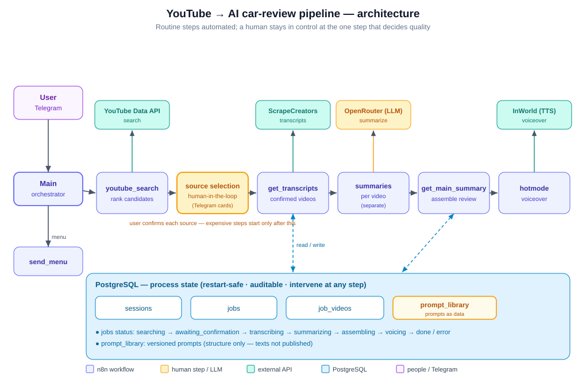

# YouTube → AI car-review pipeline (n8n)

**Stack:** n8n (self-hosted) · PostgreSQL · Telegram · YouTube Data API · OpenRouter · ScrapeCreators · InWorld (TTS)

A multi-step pipeline that turns dozens of YouTube car reviews into one finished,
sales-ready review with an AI voiceover. A car-sourcing service used to prepare each
review by hand — up to ~5 hours per car. The pipeline cuts that to ~5 minutes, while
keeping a human in control at the one step where quality is really decided.

> **Published for portfolio review, not for reuse.**
>
> Client-identifying details are removed; data and screenshots are synthetic.
> Prompt texts are not published.

## Problem

Preparing one car review meant watching and comparing many YouTube videos of different
length and quality, then writing a final review and a sales voiceover. Throughput scaled
linearly with one person's hours. But picking the *right* sources needs expert judgment —
fully automating that step is the main quality risk: bad sources in, bad review out.

## Architecture

Seven n8n workflows, with process state in PostgreSQL (restart-safe, auditable, you can
step in at any stage). Telegram is the interface.

1. **youtube_search** — search relevant reviews by make/model via the YouTube Data API,
   then rank the candidates.
2. **Main** (orchestrator) — drives the flow and shows candidates as Telegram cards.
3. **Human-in-the-loop selection** — the user confirms or rejects each source. This step
   is kept manual on purpose: expensive steps start only after confirmation, which cuts
   both the risk of working from bad sources and wasted tokens.
4. **get_transcripts** — pull transcripts for the confirmed videos (ScrapeCreators).
5. **get_summaries_from_videos** — summarize each transcript separately (OpenRouter).
   Per-video summarization loses less context on merge and keeps token cost in check.
6. **get_main_summary** — assemble the per-video summaries into one structured review.
7. **hotmode** — turn the final text into a sales voiceover (InWorld TTS).
8. **send_menu** — serves the Telegram menu.

### Key decisions

- **Human-in-the-loop exactly at the risk point** — source selection. Everything routine
  (search, transcripts, summarization, assembly, voiceover) is automated.
- **Separate per-transcript summarization** — less context loss on merge, controlled cost.
- **State in PostgreSQL** — restart-safe, auditable, allows manual intervention per step.
- **Prompts as data** — agent prompts live in a shared `prompt_library` table (texts not
  published); some agents kept inline prompts, which are redacted here.

## Data model

- **sessions** — Telegram conversation state per user (menu, mode, current car, active job).
- **jobs** — one review job per car request, with a status model.
- **job_videos** — the confirmed source videos for a job, with their transcripts and
  per-video summaries.
- **prompt_library** *(shared, structure only)* — agent prompts as data.

See [`/schema`](schema) for the sanitized DDL and the status model.

## Code

- `main_pack_for_msg.js` — builds the Telegram candidate list (numbered HTML links) shown
  at the source-selection step.

## Results

- Review prep time: **~5 hours → ~5 minutes** (~60×).
- **~130 cars** processed; working version built in **~10 days**.
- Throughput no longer scales linearly with human hours; quality control kept at the
  source-selection step.

## Possible next steps

- Make source selection hybrid: the model ranks and explains a top-N, the human only
  confirms the cut-off line.
- Transcripts depend on one external service — add a fallback (e.g. self-hosted Whisper).
- Add a quantitative quality check: does the final review cover the key car parameters
  (trims, common complaints, strong points)?

## Repository structure

| Path | What |
|---|---|
| [`/workflows`](workflows) | sanitized n8n workflow JSON (7 workflows) |
| [`/code`](code) | code-node logic |
| [`/schema`](schema) | sanitized PostgreSQL DDL + notes |
| [`/assets`](assets) | architecture diagram + screenshots |
| [`.env.example`](.env.example) | names of the secrets to configure |

## Note on secrets

Secrets live in n8n's encrypted credential store, separated from workflow logic. Exported
JSON references credentials by name only. A hard-coded operator chat id was replaced with
`OPERATOR_CHAT_ID`, inline prompt texts were redacted, and client-identifying names were
removed.
